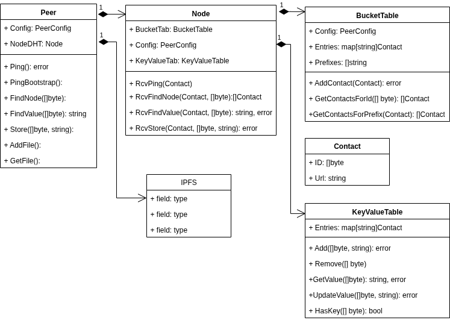

# tp7561

## Introducción DHS
@TODO desarrollar el tema de DHS

### Kademlia - a Distributed Hash Table implementation | Paper Dissection and Deep-dive

[](https://www.youtube.com/watch?v=_kCHOpINA5g)

@TODO explicar Kademlia en base al vídeo y el siguiente: https://xlattice.sourceforge.net/components/protocol/kademlia/specs.html


## Introducción IPFS

[](https://youtu.be/-ZC1-M3biyo)

@TODO explicar IPFS en base al vídeo y a los siguientes links: https://www.conquerblocks.com/post/ipfs

https://about.ipfs.io/


## Implementación del sistema

Se tiene un modulo Peer el cual presentará al exterior las funciones grpc para el manejo de la DHT y las operaciones sobre los archivos del IPFS. 
Los valores a almacenar en la DHT van a ser los nombres de los archivos dados como strings.
Las claves se encriptan mediante SHA256.




Idea sobre la estructura de los archivos:

{
    <contenido_bloque>,
    <id_siguiente_bloque>
}


## Notas para ejecución:

Se dispone del archivo config.ini el cuál permite configurar la cantidad de pares a ejecutar entre otras cosas:

```
[DEFAULT]
# --------------- PAIRS ---------------
NUMBER_OF_PAIRS = 2
ENTRIES_PER_K_BUCKET = 20
```
Iniciar o crear en entorno virtual:
```
python3 -m venv myenv

source myenv/bin/activate

```
Instalar lorem-ipsum generator p/crear set's de datos /tmp:
```
pip install lorem-text
```
Configurar entorno para protobufer:
```
export PATH=$PATH:$(go env GOPATH)/bin
export PATH=$PATH:$HOME/go/bin
export PATH=$PATH:/usr/local/go/bin
```
Si hace falta instalar Jinja:
```
pip install Jinja2
```
Ejecutar:
```
make-docker-compose-up
```
Ver log:
```
make-docker-compose-logs
```
Detener contendores:
```
make-docker-compose-down
```

NOTA: make docker-compose-logs | grep -i <exp> | grep -i <exp>
