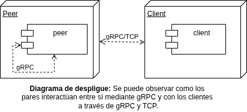
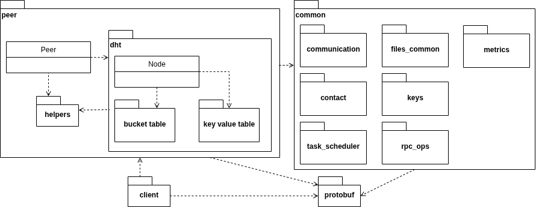

# TALLER DE PROGRAMACION III (7561)

## InterPlanetary File System (IPFS)

* Alumno: Putaro Rafael Alejandro - 84236

[Enlace Al Informe Completo En PDF](https://github.com/rafaelputaro/tp7561/blob/main/docs/TALLER%20DE%20PROGRAMACION%20III%20(7561).pdf)

## Introducción:


El crecimiento exponencial del tráfico de datos y la necesidad de sistemas más eficientes, resilientes y descentralizados han impulsado el desarrollo de nuevas arquitecturas para el almacenamiento y distribución de información. Frente a los modelos centralizados tradicionales, que presentan cuellos de botella, dependencia de servidores únicos y vulnerabilidades ante fallos o censura, surgen alternativas basadas en redes punto a punto (P2P). En este contexto, IPFS (InterPlanetary File System) se posiciona como un protocolo innovador que permite almacenar y compartir datos de forma distribuida, utilizando identificadores de contenido (CIDs) en lugar de ubicaciones de servidores.

Uno de los pilares fundamentales del funcionamiento de IPFS es su sistema de enrutamiento de contenido, que depende de una DHT (Distributed Hash Table) basada en el protocolo Kademlia. Este protocolo permite localizar nodos que almacenan datos específicos de manera eficiente, escalable y robusta ante la dinámica constante de entrada y salida de nodos en la red. Kademlia utiliza una métrica de distancia XOR para organizar los nodos y optimizar las búsquedas, minimizando el número de saltos necesarios para encontrar un recurso.

El objetivo de este trabajo práctico es analizar y comprender cómo Kademlia facilita la operación de IPFS, explorando su implementación, ventajas y desafíos en redes descentralizadas. A través de una aproximación teórico-práctica, se busca demostrar la eficacia del protocolo en la resolución de rutas de contenido y su contribución a la descentralización efectiva de la web.


## Implementación práctica:

Para observar el comportamiento del protocolo IPFS en funcionamiento se optó por una implementación limitada a unas pocas decenas de nodos con un número de clientes concurrentes reducido los operan sobre dicha red subiendo y descargando un conjunto de archivos.
Dicha implementación está dada por una serie de contenedores de Docker, desarrollados fundamentalmente en Golang, los cuales son análogos de pares en una red IPFS que interactúan entre sí mediante llamadas a procedimiento remoto (en este caso gRPC).
Por otro lado los clientes concurrentes que consumen los servicios de los nodos (o pares) de esta red IPFS interactúan con los mismos alternando entre llamados gRPC y la utilización de socket’s TCP. Estos clientes también están dados por contenedores Docker desarrollados en Golang.



Para la recolección de métricas se utilizó tanto Prometheus como cAdvisor, mientras que para su visualización se ha optado por Grafana.

El sistema consiste principalmente en un paquete “peer” que contiene la implementación del IPFS y un paquete de “client” que consume los servicios de la red de nodos. Ambos paquetes se apoyan en el módulo “common” el cuál contiene módulos dedicados a la comunicación, la gestión de archivos, inicialización de métricas, la implementación de contactos (datos de cada nodo como la url y su identificación), gestión de claves, un planificador de tareas y las operaciones gRPC necesarias tanto para subir como para descargar archivos.
Adicionalmente se tiene un paquete “protobuf” que define los servicios gRPC, los resultados, operandos e implementa una serie de funciones que facilitan el uso de este protocolo en la presente implementación.



Para más información visitar el informe completo: [Enlace Al Informe Completo En PDF](https://github.com/rafaelputaro/tp7561/blob/main/docs/TALLER%20DE%20PROGRAMACION%20III%20(7561).pdf)

## Instrucciones para la ejecución del sistema:

Se dispone del archivo "config.ini" el cuál permite configurar la cantidad de pares y clientes a ejecutar entre otras cosas.

Iniciar o crear en entorno virtual:
```
python3 -m venv myenv

source myenv/bin/activate

```
Instalar lorem-ipsum generator p/crear set's de datos /tmp:
```
pip install lorem-text
```
Configurar entorno para protobufer:
```
export PATH=$PATH:$(go env GOPATH)/bin
export PATH=$PATH:$HOME/go/bin
export PATH=$PATH:/usr/local/go/bin
```
Si hace falta instalar Jinja:
```
pip install Jinja2
```
Ejecutar:
```
make docker-compose-up
```
Ver log:
```
make docker-compose-logs
```
Detener contenedores:
```
make docker-compose-down
```

Para visualizar el log del cliente:
```
 make docker-compose-logs | grep -i client
```

Para ingresar al administrador de Prometheus visitar:

http://localhost:9090/

Para ingresar al administrador de Grafana visitar:

http://localhost:3000/login

Para ingresar al administrador de cAdvisor visitar:

http://localhost:8079/

Para visualizar las métricas citadas en el informe se deben cargar en Grafana los dashboards que se encuentran en la carpeta src/grafana/dashboards